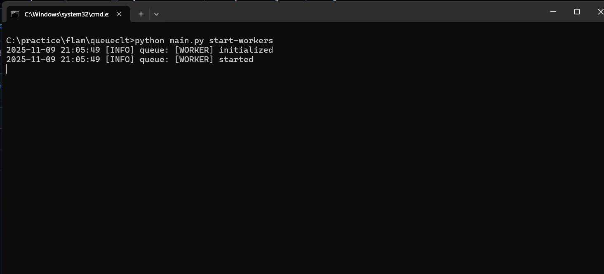
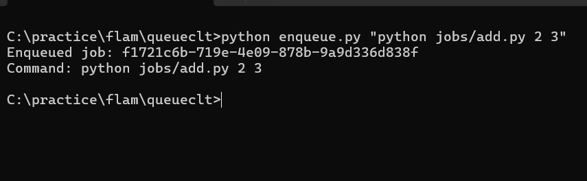
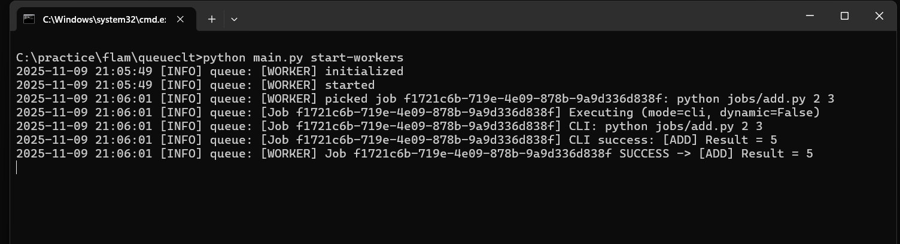
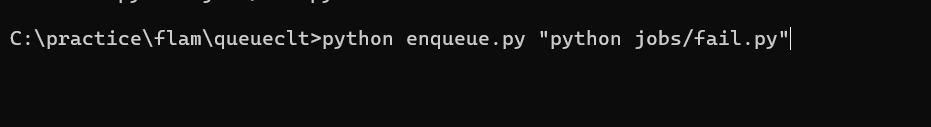
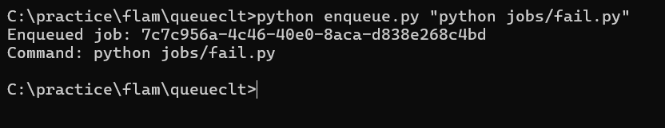
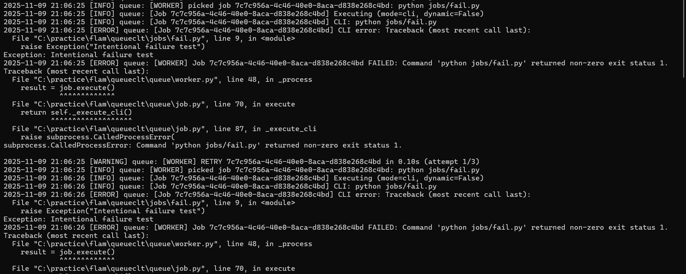
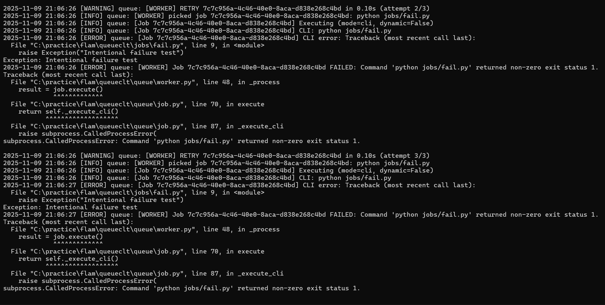
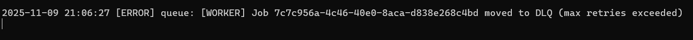
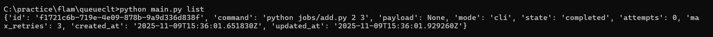
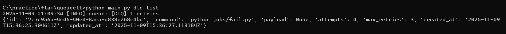

```markdown
# Minimal Production-Grade Job Queue System

## 1. Description
This project implements a lightweight, production-grade job queue system in Python. It allows enqueuing, executing, and managing background jobs with retries, failure handling, and persistent storage. Jobs can be executed either as CLI commands or as Python functions dynamically. Multiple worker processes can run concurrently, and failed jobs are automatically moved to a Dead Letter Queue (DLQ) after exhausting retry attempts.

---

## 2. Features and Implementation

- **Enqueuing and Managing Background Jobs**  
  Implemented via `enqueue.py` and `queue/helper.py`. Jobs can be created dynamically or via CLI commands. Each job contains `id`, `command`, `payload`, `state`, `attempts`, `max_retries`, `created_at`, and `updated_at`.

- **Running Multiple Worker Processes**  
  `queue/worker.py` defines the `Worker` class that continuously polls the database for pending jobs. Multiple workers can be started to process jobs concurrently.

- **Retrying Failed Jobs Automatically with Exponential Backoff**  
  Failed jobs increment their `attempts` count and are retried up to `max_retries` times. A delay of 0.1–2 seconds (configurable) is applied between retries.

- **Dead Letter Queue (DLQ)**  
  Jobs that exceed `max_retries` are marked as dead and moved to the DLQ (`queue/db.py`). They can be inspected or restored later.

- **Persistent Job Storage Across Restarts**  
  Jobs and DLQ entries are stored in an SQLite database (`queue.db`) with thread-safe access.

- **CLI Interface for All Operations**  
  All major operations — enqueue, start workers, list jobs, restore DLQ — are accessible via CLI commands.

---

## 3. Extra Features

- Automatic detection of job type (CLI vs dynamic Python function).  
- Payload support for Python jobs.  
- Detailed logging with timestamps to both console and log files (`logs/queue.log`).  
- Thread-safe SQLite access for multi-worker setups.  

---

## 4. File Structure


queueclt/
├─ jobs/
│  ├─ add.py          # Example CLI/dynamic success job
│  ├─ fail.py         # Example CLI/dynamic fail job
├─ queue/
│  ├─ __init__.py
│  ├─ helper.py       # Job creation helper
│  ├─ db.py           # Database operations
│  ├─ job.py          # Job class and execution logic
│  ├─ worker.py       # Worker logic for processing jobs
│  ├─ utils.py        # Logging, timestamps, backoff
│  ├─ config.py       # Config variables
│  ├─ helper.py       # to wrap the jobs for getting metadata
│  ├─ metrics.py 
|  |─dlq.py           # to push into dlq list
├─ enqueue.py          # CLI script to enqueue jobs
├─ main.py             # CLI entry point for workers and management
├─ queue.db            # SQLite database (auto-created)
├─ logs/               # Log directory

```

````

---

## 5. File Descriptions

- **add.py** – Example job that adds two numbers; works via CLI or Python dynamic function.  
- **fail.py** – Example job that intentionally fails to test retry and DLQ functionality.  
- **helper.py** – Provides `make_job()` to create Job objects with correct metadata.  
- **db.py** – Handles SQLite storage, job CRUD, and DLQ operations.  
- **job.py** – Defines `Job` class with CLI and dynamic Python execution, state transitions, and serialization.  
- **worker.py** – Implements worker polling, processing, retries, and DLQ handling.  
- **utils.py** – Logger, timestamp generator, backoff calculations, and output truncation.  
- **config.py** – Configurations such as database path, max retries, logging, poll intervals.  
- **enqueue.py** – CLI script to enqueue jobs of any type.  
- **main.py** – CLI interface for starting workers and managing jobs.  

---

## 6. Setup Instructions

1. Clone the repository:

```bash
git clone <repo-url>
cd queueclt
````

2. Ensure Python 3.10+ is installed.

3. (Optional) Create a virtual environment:

```bash
python -m venv venv
source venv/bin/activate   # Linux/Mac
venv\Scripts\activate      # Windows
```

4. Install dependencies (standard library only, no external packages required).

5. Start the worker:

```bash
python main.py start-workers
```

---

## 7. Usage Examples

**Enqueue a CLI job (add.py):**

```bash
python enqueue.py "python jobs/add.py 2 3"
```

**Enqueue a dynamic Python job (add.py):**

```bash
python enqueue.py jobs.add.run '{"a":2,"b":3}'
```

**Enqueue a failing job (fail.py CLI):**

```bash
python enqueue.py "python jobs/fail.py"
```

**Enqueue a failing dynamic Python job:**

```bash
python enqueue.py jobs.fail.run
```

**View jobs in DLQ (Python REPL):**

```python
from queue.db import list_dlq
print(list_dlq())
```

**Restore a DLQ job:**

```python
from queue.db import restore_dlq
restore_dlq("<job-id>")
```

---

## 8. Assumptions and Trade-Offs

* SQLite is used for persistence: sufficient for small-scale setups, but not for very high concurrency.
* Retry backoff is configurable; default 0.1s fixed for testing, can use `utils.exponential_backoff` for production.
* CLI and dynamic Python jobs are mutually exclusive per job.
* No external job queue frameworks (like Celery) are used; simplicity prioritized.

---

## 9. Verify Functionality

1. Start a worker:

```bash
python main.py start-workers
```

2. Enqueue jobs:

```bash
python enqueue.py "python jobs/add.py 2 3"
python enqueue.py jobs.add.run '{"a":2,"b":3}'
python enqueue.py "python jobs/fail.py"
python enqueue.py jobs.fail.run
```

3. Observe logs in terminal and `logs/queue.log`.

4. Failed jobs exceeding retries will appear in DLQ:

```python
from queue.db import list_dlq
print(list_dlq())
```

5. Restore DLQ jobs and retry:

```python
from queue.db import restore_dlq
restore_dlq("<job-id>")
```

## Results

Here are the results in order:

### 1


### 2


### 3


### 4


### 5


### 6


### 7


### 8


### 9


### 10



